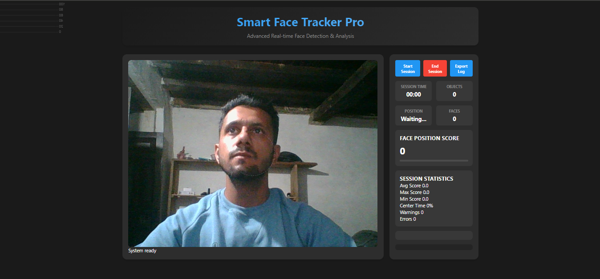
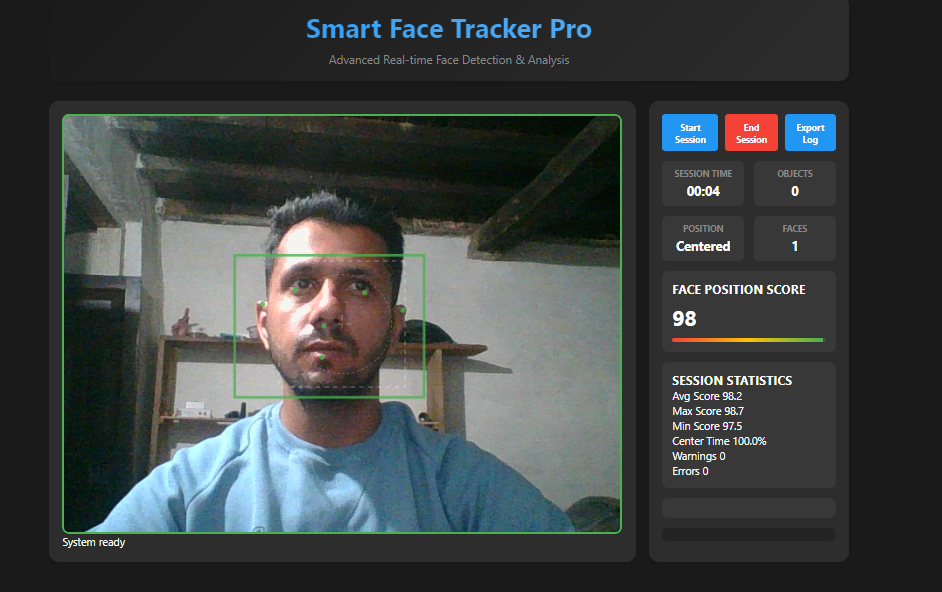
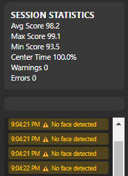
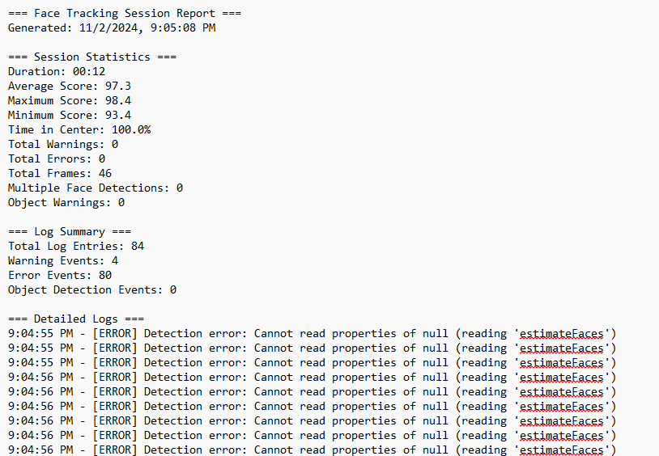

# Smart Face Tracker Pro

## Overview
Smart Face Tracker Pro is a real-time face tracking and analysis application that uses AI to monitor face position, detect objects, and provide instant feedback on positioning quality. Built with TensorFlow.js and modern web technologies, it offers professional-grade face tracking with detailed analytics and session logging.

## Features
- **Real-time Face Tracking**: Precise face detection and position monitoring
- **Object Detection**: Identifies and counts objects in frame
- **Position Scoring**: Dynamic scoring system based on face position and external factors
- **Session Management**: Complete session tracking with detailed statistics
- **Live Analytics**: Real-time performance metrics and visual feedback
- **Comprehensive Logging**: Detailed event logging with exportable session reports
- **Multiple Detection Alerts**: Automatic session control for multiple faces
- **Visual Feedback**: Color-coded indicators and position guides

## Technical Stack
- TensorFlow.js for AI-powered detection
- Blazeface for face landmark detection
- COCO-SSD for object detection
- Chart.js for real-time data visualization
- Modern JavaScript (ES6+) with modular architecture

## Installation
1. Clone the repository:
```bash
git clone https://github.com/yourusername/smart-face-tracker-pro.git
```

2. Navigate to the project directory:
```bash
cd smart-face-tracker-pro
```

3. Serve the project using a local web server (required for ES6 modules):
```bash
# Using Python 3
python -m http.server 8000

# Or using Node.js http-server
npx http-server
```

4. Open in browser:
```
http://localhost:8000
```

## Project Structure
```
project/
├── index.html          # Main HTML file
├── style/
│   └── style.css      # CSS styles
├── js/
│   ├── main.js        # Main application logic
│   ├── session.js     # Session management
│   └── log.js         # Logging system
└── README.md
```

## Usage
1. Grant camera permissions when prompted
2. Click "Start Session" to begin tracking
3. Position your face in the center of the frame
4. Monitor real-time metrics and position score
5. View session logs and analytics in real-time
6. Export session data when finished

## Features in Detail

### Face Tracking
- Real-time position monitoring
- Center zone guidance
- Face landmark visualization
- Position scoring system

### Object Detection
- Real-time object counting
- Object interference monitoring
- Position impact analysis
- Visual object marking

### Session Management
- Complete session statistics
- Time tracking
- Performance metrics
- Auto-termination on violations

### Logging System
- Detailed event logging
- Warning and error tracking
- Exportable session reports
- Real-time log visualization

## Performance Metrics
- Face position score (0-100)
- Center time percentage
- Object detection counts
- Warning and error tracking
- Session duration
- Average, maximum, and minimum scores

## Browser Support
- Chrome (recommended)
- Firefox
- Edge
- Safari (limited support)

## Requirements
- Modern web browser with camera access
- JavaScript enabled
- Stable internet connection (for initial model loading)

## Contributing
Contributions are welcome! Please feel free to submit a Pull Request.

## License
This project is licensed under the MIT License - see the LICENSE file for details.

## Acknowledgments
- TensorFlow.js team for the AI models
- Chart.js for visualization capabilities
- MediaPipe team for face detection technology

---
For issues, feature requests, or contributions, please open an issue on the GitHub repository.